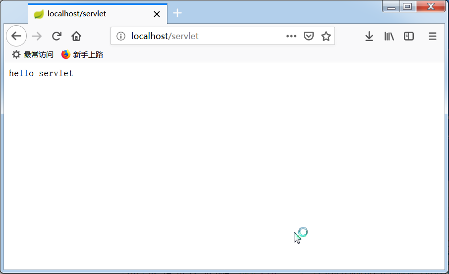
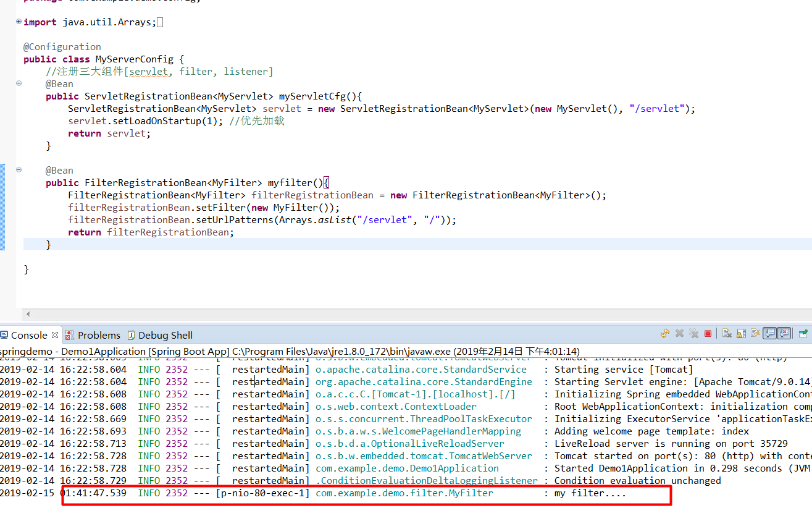

# springboot添加自定义servlet, filter,listener，

## 注册三大组件

### 1.编写`MyServlet.java`

用于测试，让他向浏览器输出一句话就好了

```java
public class MyServlet extends HttpServlet{

	@Override
	protected void doGet(HttpServletRequest req, HttpServletResponse resp) throws ServletException, IOException {
		// TODO Auto-generated method stub
		doPost(req, resp);
	}

	@Override
	protected void doPost(HttpServletRequest req, HttpServletResponse resp) throws ServletException, IOException {
		resp.getWriter().write("hello servlet");
	}

}

```
### 2.编写`MyServerConfig.java`

```java
@Configuration //让spring知道这是一个配置类
public class MyServerConfig {
	//注册三大组件[servlet, filter, listener]
	@Bean //将组件添加到spring容器中才能生效
	public ServletRegistrationBean<MyServlet> myServletCfg(){
		ServletRegistrationBean<MyServlet> servlet = new ServletRegistrationBean<MyServlet>(
            //自定义的servlet
            new MyServlet(),
            //servlet请求地址
            "/servlet");
		servlet.setLoadOnStartup(1); //优先加载
		return servlet;
	}
}

```

启动springboot项目浏览器输入servlet请求地址测试结果。



要像以前一样使用自己的servlet就是这么简单。。注册进去就好了 ，同理演示一下filter的添加方式

### 3.编写`MyFilter.java`

用于演示不做具体过滤业务，日志打印一句话就好了，直接放行。

```java
import java.io.IOException;
import javax.servlet.Filter;
import javax.servlet.FilterChain;
import javax.servlet.ServletException;
import javax.servlet.ServletRequest;
import javax.servlet.ServletResponse;

import lombok.extern.slf4j.Slf4j;

@Slf4j
public class MyFilter implements Filter{
	@Override
	public void doFilter(ServletRequest request, ServletResponse response, FilterChain chain)
			throws IOException, ServletException {
		log.info("my filter....");
		chain.doFilter(request, response);
	}
}

```

接着向刚才编写的`MyServerConfig.java`中注册进去就好了，代码如下

```java
@Configuration
public class MyServerConfig {
	//注册三大组件[servlet, filter, listener]
    
	@Bean
	public ServletRegistrationBean<MyServlet> myServletCfg(){
		ServletRegistrationBean<MyServlet> servlet = new ServletRegistrationBean<MyServlet>(new MyServlet(), "/servlet");
		servlet.setLoadOnStartup(1); //优先加载
		return servlet;
	}
	
    //注册自己的过滤器
	@Bean
	public FilterRegistrationBean<MyFilter> myfilter(){
		FilterRegistrationBean<MyFilter> filterRegistrationBean = new FilterRegistrationBean<MyFilter>();
        //添加自己的过滤器
		filterRegistrationBean.setFilter(new MyFilter());
        //过滤"/servlet", "/"请求
		filterRegistrationBean.setUrlPatterns(Arrays.asList("/servlet", "/"));
		return filterRegistrationBean;
	}

}

```

完成。控制台日志打印"my filter...."



对于listener同样的流程，编写自己的监听器，接着注册到`MyServerConfig.java`

## 总结

`ServletRegistrationBean<MyServlet>`

`FilterRegistrationBean<MyFilter>`

`ServletListenerRegistrationBean<MyListener>`

springboot提供上述三个类用于添加自己的servlet三大组件。